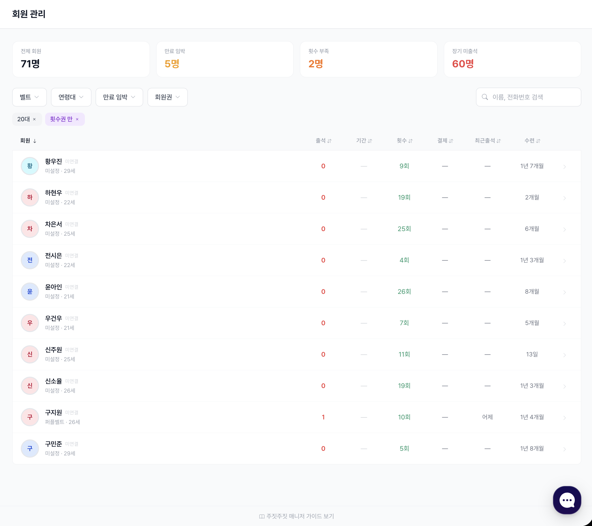
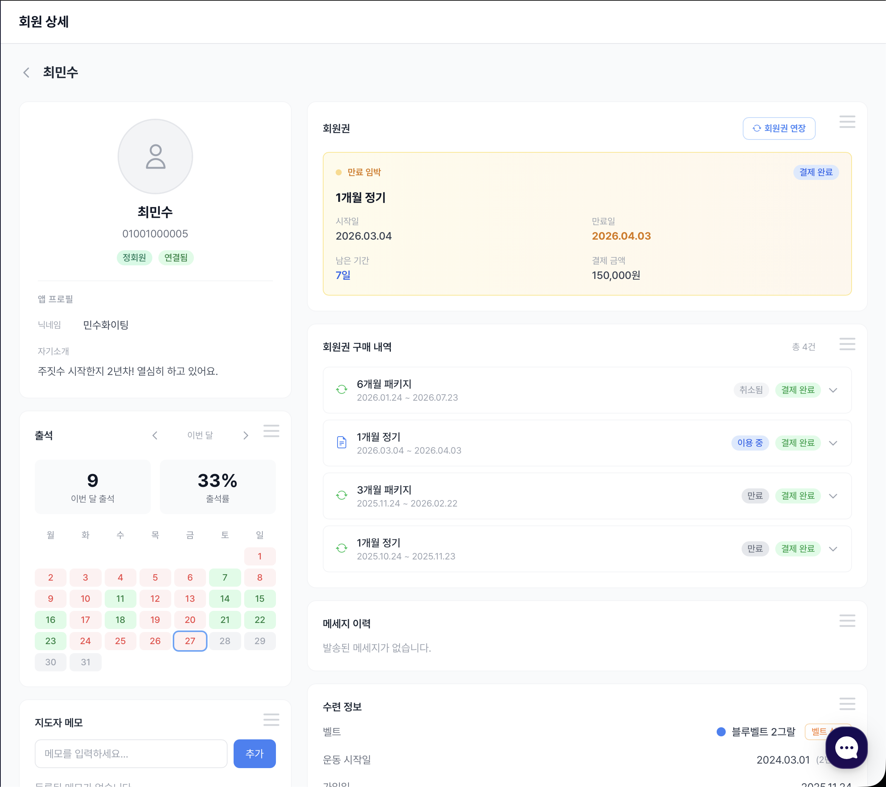
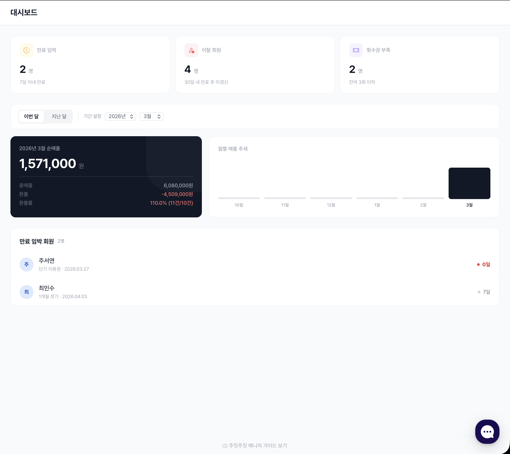

# 주요 기능 훑어보기

도장 운영에 필요한 모든 것을 하나의 화면에서 관리합니다.\
회원 등록부터 승급식까지, 주짓주짓 매니저의 핵심 기능을 소개합니다.

---

## 시작하기

회원을 받기 전에 딱 3가지만 준비하세요.

### 1. 입관 계약서 생성

종이 계약서 대신 **전자 계약서**를 사용합니다.\
환불 규정, 촬영 동의, 주의사항 등 도장에 맞는 양식을 직접 구성할 수 있습니다.

지도자 서명을 미리 등록해 두면 회원이 서명할 때 계약서 PDF에 함께 들어갑니다.

<div align="left"><figure><figcaption>서명을 직접 그려서 등록</figcaption></figure></div>

<div align="left"><figure><figcaption>등록된 서명은 모든 계약서에 자동 적용</figcaption></figure></div>

→ 자세히 보기: [계약서 관리](contracts/)

### 2. 회원권 생성

**기간제**(1개월, 3개월…) 또는 **횟수제**(10회, 20회…) 회원권을 등록합니다.\
정가·할인가·설명을 한 화면에서 설정합니다.

<div align="left"><figure><figcaption>기간권 / 횟수권 선택 후 기본 정보 입력</figcaption></figure></div>

→ 자세히 보기: [회원권 관리](membership-plans.md)

### 3. 회원권에 입관 계약서 연결

만든 계약서를 회원권에 연결합니다.\
이후 해당 회원권으로 계약서를 발송하면 **연결된 양식이 자동으로 적용**됩니다.\
회원권마다 다른 계약서를 연결할 수 있어, 수업 유형별로 계약 조건을 다르게 운용할 수 있습니다.

<div align="left"><figure><figcaption>회원권 생성 시 계약서 템플릿 연결</figcaption></figure></div>


등록된 회원권은 [주짓주짓 매니저](https://manager.thisisbjj.com)에서 언제든 확인하고 수정할 수 있습니다.




---

## 회원 등록하기

준비가 끝났으면 회원을 등록합니다.

### A. 계약서 발송하기

회원권을 선택하고 이름·전화번호를 입력하면 **카카오 알림톡**으로 계약서 링크가 발송됩니다.

<div align="left"><figure><figcaption>회원권 선택 → 수신자 정보 입력 → 발송</figcaption></figure></div>

회원은 앱 설치 없이 **모바일 브라우저에서 바로 서명**합니다.

<div align="center"><figure><figcaption>회원이 받는 카카오 알림톡</figcaption></figure></div>

서명이 완료되면 **실시간 알림**이 오고, 결제를 확인하면 회원 등록이 완료됩니다.

→ 자세히 보기: [계약서 발송](contracts/sending.md) · [서명 과정](contracts/signing-flow.md)

### B. 타 업체에서 회원 데이터 이전하기

기존 시스템(다짐 등)에서 **엑셀 파일로 내보낸 후 업로드**하면 회원 정보가 일괄 이전됩니다.\
현재 다짐(DaGym) 형식을 지원하며, 추후 다른 프로그램도 지원 예정입니다.

<div align="left"><figure><figcaption>이전할 프로그램 선택 후 엑셀 파일 업로드</figcaption></figure></div>

파일 업로드 후 관리자 검토를 거쳐 보통 **1\~2 영업일** 이내에 이전이 완료됩니다.

→ 자세히 보기: [데이터 이관](data-migration.md)

---

## 키오스크 모드

도장 입구에 태블릿 하나만 두세요.\
회원이 **휴대폰 뒷자리 4자리**를 입력하면 출석 체크가 끝납니다.

<div align="left"><figure><figcaption>뒷자리 4자리 입력 → 회원 확인 → 체크인 완료</figcaption></figure></div>

- **횟수제 회원권** — 체크인 시 자동으로 1회 차감
- **기간제 회원권** — 출석 기록만 남김

벨트가 설정되지 않은 회원이 체크인하면 **1회만 벨트 선택 화면이 노출**됩니다.\
데이터 이관 직후나 신규 회원이 많을 때, 일일이 벨트를 등록할 필요 없이 출석 시 자연스럽게 설정됩니다.

<div align="left"><figure><figcaption>체크인 → 벨트 색상 선택 → 설정 완료 (1회만 노출)</figcaption></figure></div>


**키오스크 세팅 팁**: 태블릿 브라우저를 전체 화면(F11)으로 설정하고, 자동 잠금을 꺼두세요.\
→ 자세한 설정: [키오스크 설정](attendance/kiosk.md)


→ 자세히 보기: [출석 & 키오스크](attendance/) · [출석 통계](attendance/stats.md)

---

## 회원 관리

등록된 회원 전체를 한눈에 파악하고, 개별 관리까지 한 곳에서 처리합니다.

<div align="left"><figure><figcaption>벨트·연령대·만료일 필터로 원하는 회원을 즉시 검색</figcaption></figure></div>

| 기능 | 설명 |
|---|---|
| 벨트·연령대·만료일 필터 | 원하는 조건으로 회원을 즉시 검색 |
| 원클릭 승급 | 회원 상세에서 버튼 한 번으로 다음 벨트 승급 |
| 횟수 조정 | 횟수제 회원의 잔여 횟수를 직접 가감 (사유 기록) |
| 메모 | 회원별 메모 작성 — 부상 이력, 개인 목표 등 |
| 운동 시작일·건강 정보 | 훈련 시작일, 건강 메모, 비상연락처 기록 |
| 만료 알림 발송 | 만료 임박 회원에게 카카오 알림톡으로 갱신 안내 |

<div align="left"><figure><figcaption>회원 상세 — 프로필, 벨트 이력, 출석, 메모를 한 화면에서 관리</figcaption></figure></div>

→ 자세히 보기: [회원 관리](members/) · [회원 상세](members/detail.md) · [벨트 관리](members/belt-management.md)

---

## 정산 관리

### 1. 정산 대시보드

이번 달 매출과 도장 상태를 한 화면에서 확인합니다.

<div align="left"><figure><figcaption>월 매출 추이, 환불률, 만료 임박 회원을 한눈에</figcaption></figure></div>

| 지표 | 내용 |
|---|---|
| 월 매출 추이 | 최근 6개월 순매출·총매출 그래프 |
| 환불률 | 환불 금액·건수·비율 |
| 만료 임박 회원 | 7일 이내 만료 예정 목록 |
| 이탈 회원 | 최근 30일 내 이탈 회원 수 |
| 출석 저조 회원 | 출석 3회 미만 회원 파악 — 이탈 사전 감지 |

### 2. 수납 관리

모든 결제 건을 날짜순으로 조회하고, 세무 자료로 바로 활용합니다.

<div align="left"><figure><figcaption>기간·상태별 결제 내역 조회 + Excel 내보내기</figcaption></figure></div>

| 기능 | 설명 |
|---|---|
| 기간별 조회 | 날짜 범위를 설정해 결제 내역 검색 |
| 상태 필터 | 계약 체결 / 결제 완료 / 환불 등 상태별 보기 |
| 결제 수단 수정 | 잘못 기록된 결제 수단 정정 |
| 결제 상세 | 회원명·회원권·결제일·출석 횟수·타임라인 확인 |
| 환불 처리 | 환불 금액·사유·처리일 기록 |
| Excel 내보내기 | XLSX 파일로 다운로드 (세무·회계 제출용) |

→ 자세히 보기: [정산](settlement.md)

---

## 승급식

출석 기준으로 승급 후보자를 **자동 추출**하고, 검토 후 **일괄 승급**합니다.\
더 이상 엑셀이나 수첩에 출석일수를 세지 않아도 됩니다.

```
승급식 생성 → 최소 출석일 설정 → 후보자 자동 추출 → 벨트 검토·조정 → 확정 → 일괄 승급
```

<div align="left"><figure><figcaption>출석 기준으로 후보자를 자동 추출하고, 벨트를 개별 조정</figcaption></figure></div>

| 기능 | 설명 |
|---|---|
| 출석 기준 후보 추출 | "60일 이상 출석" 등 조건을 설정하면 대상자를 자동 선별 |
| 벨트 개별 조정 | 후보자별로 승급 벨트를 변경하거나 제외 가능 |
| 일괄 승급 실행 | 확정 후 한 번에 모든 후보자의 벨트를 업데이트 |
| 이전 기준 불러오기 | 지난 승급식 조건을 그대로 재사용 |

<div align="left"><figure><figcaption>확정 후 일괄 승급 실행 — 모든 후보자의 벨트가 한 번에 업데이트</figcaption></figure></div>

→ 자세히 보기: [승급식](ceremonies.md)

---

궁금한 점은 [카카오톡 채널](https://pf.kakao.com/_NnxmZX)로 문의해 주세요.
